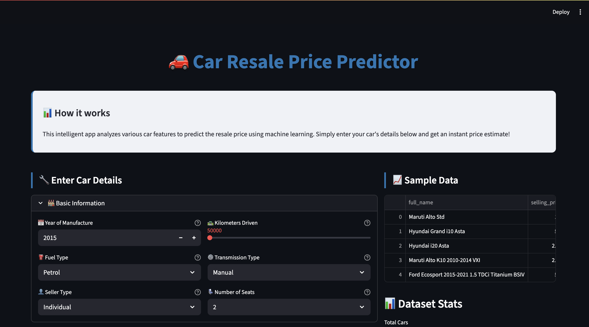
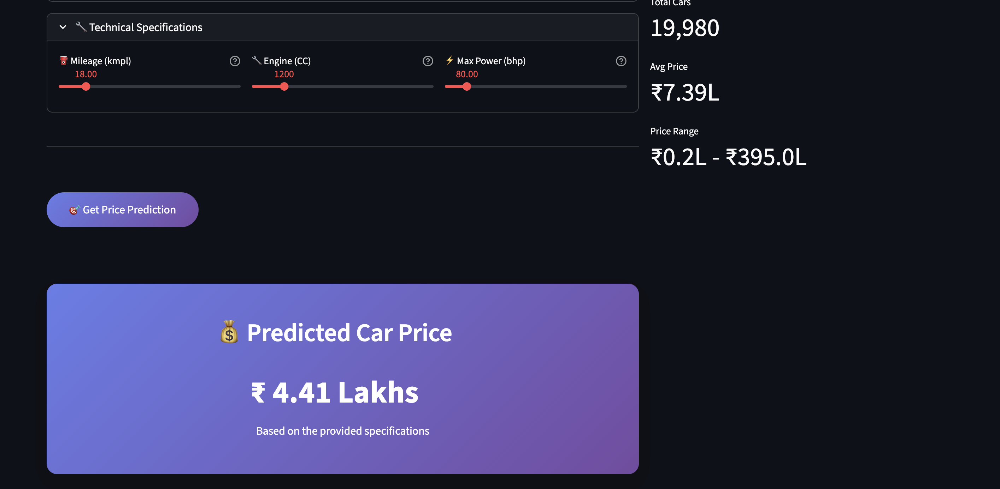

# 🚗 Car Resale Price Prediction App  

This is a **Machine Learning Web App** built with **Streamlit** that predicts the resale price of a car based on its features such as year, kilometers driven, fuel type, transmission, engine power, mileage, etc.  

The app uses a **pre-trained machine learning model** trained on the **Cars24 dataset** and provides an interactive UI for users to input car details and get an estimated price instantly.  

---

## 📌 Features  
- Uploads and displays the Cars24 dataset.  
- Interactive inputs for all car features (sliders, dropdowns, and number inputs).  
- Encodes categorical features consistently with the training pipeline.  
- Predicts resale price using a pre-trained ML model (`car_pred_model`).  
- Clean Streamlit interface with real-time prediction.  

---

## 🛠️ Tech Stack  
- **Python 3.9+**  
- **Streamlit** – for the web interface  
- **scikit-learn** – for model training  
- **Pandas / NumPy** – for data handling  
- **Pickle** – for saving & loading ML model  

---

## 📂 Project Structure  

├── car_price.py # Streamlit app code
├── cars24-car-price.csv # Dataset
├── car_pred_model # Pre-trained ML model (pickle file)
├── requirements.txt # Python dependencies
└── README.md # Project documentation


1️⃣ Clone the repository
```bash
git clone https://github.com/vaibhavpande21//car_price_prediction.git
cd genai-rag-chatbot
```

2️⃣ Create a virtual environment
```bash
python -m venv .venv  
source .venv/bin/activate   # Mac/Linux  
.venv\Scripts\activate      # Windows
```

3️⃣ Install dependencies
```bash
pip install -r requirements.txt
```

▶️ Running the App
Start the Streamlit app:
```bash
streamlit run app.py
```
---

## 📸 Screenshots  

### 🏠 Home Page  
  

### 📊 Prediction Example  
  


📊 Dataset

- The dataset (cars24-car-price.csv) contains car listings from Cars24.
  
Features include:
 year, km_driven, fuel_type, seller_type, transmission_type, mileage, engine, max_power, seats

Target variable:
 selling_price


---

## Contact

For questions or collaboration, feel free to connect:

**Vaibhav**  
Data Science & Machine Learning @Scaler Academy  
[LinkedIn](https://www.linkedin.com/in/vaibhav-pandey-re2103/) • [GitHub](https://github.com/vaibhpande21)

---

If you find this project useful, please consider starring the repository!

